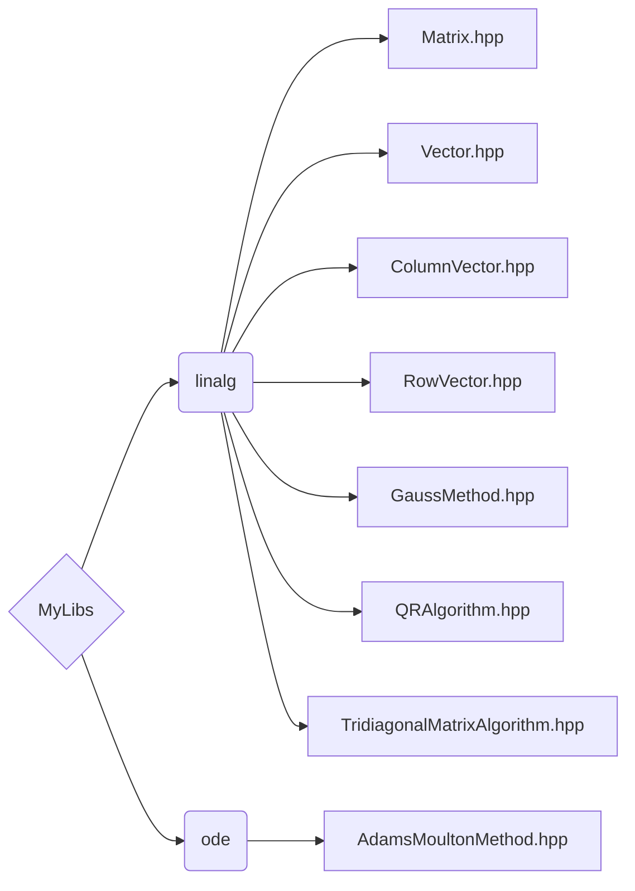

# MyLibs


Static library for numerical methods (linear algebra and ODE methods)

> [!NOTE]
> Header-only + implementations `.tpp`, `src/dummy.cpp` keeps MSVC static-lib target valid, minimum C++17, Visual Studio 2022 (MSVC v143)


## Features
| Class                                                                                                    | One-line features                     |
| -------------------------------------------------------------------------------------------------------- | ------------------------------------- |
| [Matrix](MyLibs/include/linalg/Matrix.hpp)                                                               | Arithmetic, det & inv (Gauss), LU, QR |
| [Vector](MyLibs/include/linalg/Vector.hpp)                                                               | Arithmetic, ‖·‖₁ & ‖·‖₂ & ‖·‖∞, dot   |
| [ColumnVector](MyLibs/include/linalg/ColumnVector.hpp), [RowVector](MyLibs/include/linalg/RowVector.hpp) | Transpose, matrix-vector products     |
| [GaussMethod](MyLibs/include/linalg/GaussMethod.hpp)                                                     | Solve via Gaussian elimination        |
| [QRAlgorithm](MyLibs/include/linalg/QRAlgorithm.hpp)                                                     | Solve via QR factorization            |
| [TridiagonalMatrixAlgorithm](MyLibs/include/linalg/TridiagonalMatrixAlgorithm.hpp)                       | Thomas algorithm                      |
| [AdamsMoultonMethod](MyLibs/include/ode/AdamsMoultonMethod.hpp)                                          | Implicit 5-step IVP solver            |

- **[Matrix](MyLibs/include/linalg/Matrix.hpp)**:
  - arithmetic on matrices
  - determinant and inverse via Gaussian elimination
  - adjoint (conjugate transpose)
  - Hermitian (symmetric for real matrices) check
  - positive-definiteness check via Cholesky decomposition attempt
  - LU and QR decompositions
- **[Vector](MyLibs/include/linalg/Vector.hpp)**:
  - arithmetic on vectors
  - ‖·‖₁ (Manhattan), ‖·‖₂ (Euclidean), ‖·‖∞ (Chebyshev) norms
  - inner (dot) product
- **[ColumnVector](MyLibs/include/linalg/ColumnVector.hpp), [RowVector](MyLibs/include/linalg/RowVector.hpp)**:
  - transpose
  - vector-matrix and matrix-vector products with compatible shapes
- **[GaussMethod](MyLibs/include/linalg/GaussMethod.hpp)**:
  - forward elimination and back substitution
  - solves linear systems by Gaussian elimination
- **[QRAlgorithm](MyLibs/include/linalg/QRAlgorithm.hpp)**:
  - solves linear systems via QR factorization
- **[TridiagonalMatrixAlgorithm](MyLibs/include/linalg/TridiagonalMatrixAlgorithm.hpp)**:
  - solves tridiagonal linear systems via Thomas algorithm
- **[AdamsMoultonMethod](MyLibs/include/ode/AdamsMoultonMethod.hpp)**:
  - implicit 5-step Adams-Moulton solver for initial-value problems for ODEs and systems of ODE

### Expression templates (lazy evaluation)
Matrix and vector arithmetic uses expression templates. Chained expressions allocate no temporaries and evaluation is fused at assignment.
Example: `D = A + B + 2 * C;` performs a single pass

## Structure


## Requirements
- Visual Studio 2022 (MSVC v143)
- C++17 enabled

## Build (Visual Studio)
1. Open `MyLibsSolution.sln`
2. Build **MyLibs** as `Static library (.lib)` in Debug/Release
3. Add to your project in properties:
   - **C/C++** → **Additional Include Directories** → `<Your_path>\MyLibsSolution\MyLibs\include`
   - **Linker** → **Additional Library Directories** → `<Your_path>\MyLibs\x64\<Config>`
   - **Linker** → **Input** → **Additional Dependencies** → `MyLibs.lib`

## Examples
- Power method: [examples/power_method/main.cpp](examples/power_method/main.cpp)
  </details> <details><summary>I/O</summary>

  Input:
  ```txt
  3
  -3 4 -2
  1 0 1
  6 -6 5
  ```

  Output:
  ```txt
  Random initial vector: [-9139 3783 7100]
  The eigenvalue with maximum modulus = 2,
  and the corresponding eigenvector: [1.10723e-12 -0.5 -1]
  Residual = 5.85357e-12
  ```

  </details>

- Gradient descent for nonlinear system of equations: [examples/gradient_descent_method_for_nonlinear_system/main.cpp](examples/gradient_descent_method_for_nonlinear_system/main.cpp)
  </details> <details><summary>I/O 1</summary>

  Input:
  ```txt
  2
  -3 2
  ```

  Output:
  ```txt
  Solution: [-1.60607e-05 5]
  Residual = 1.6794e-05
  ```

  </details>

  </details> <details><summary>I/O 2</summary>

  Input:
  ```txt
  3
  -3 4 6
  ```
  
  Output:
  ```txt
  Solution: [1 2 3]
  Residual = 3.64039e-06
  ```

  </details>